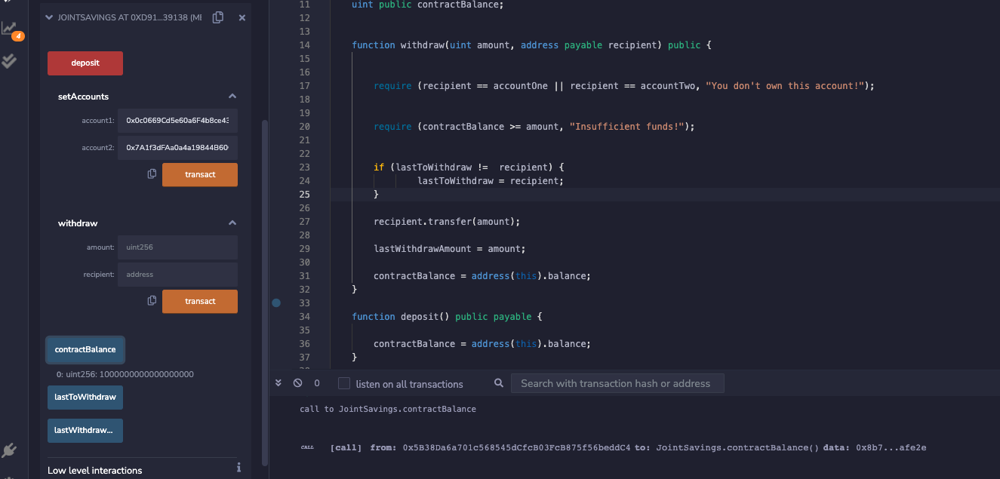
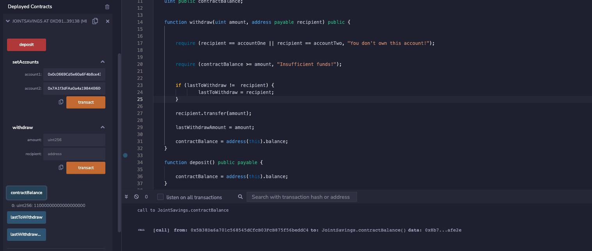
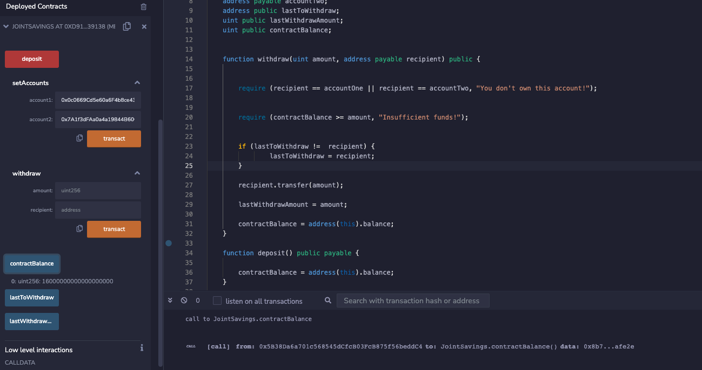

# Blockchain_joint_account

This solidity smart contract automates the creation of joint savings accounts by accepts two user addresses. These addresses will be able to control the joint savings account. The smart contract uses ether management functions to implement a financial institution’s requirements for providing the features of the joint savings account. These features consists of the ability to deposit and withdraw funds from the account.

You can see screenshot of the contract execution results below:

- Deposit - Transaction 1 

- Deposti - Transaction 2

- Deposit - Transaction 3 

- Withdraw from joint account to account 1 

- Withdraw from joint account to account 2

- Verification of last withdraw (account and amount)

